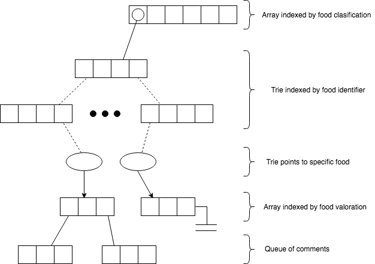

# restaurant-menu

This data structure aims to grant **effectiveness** storing all your food courses.

The *core* of this structure is a **trie**, indexed by food *identifiers*.

Every course belongs a type, that can be *incoming*, *first*, *second*, *dessert* or *drink*, and have a **unique** identifier.

The structure must accept customers ratings too, which can be *good*, *ok*, *poor*.

A graphic that ilustrates this data structure is shown below:

